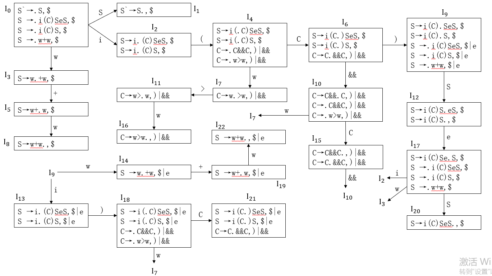
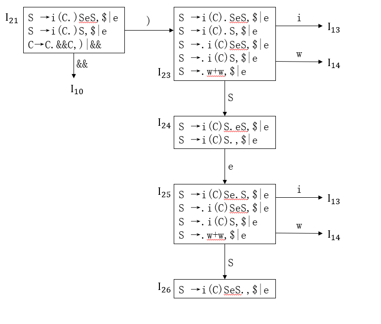

# 实验报告

## 实验截图

## 实验过程

- 自定义文法
- 构造 LR(1) DFA
- 构造 LR(1) 分析表
- 将 LR(1) 分析表代码化
- 编写程序使用分析表完成语法分析器程序
- 输入字符流，先通过词法分析器生成 Token 序列，再通过语法分析器得到规约序列

## 实验详解

### 自定义文法

- 为了防止状态数过于爆炸，精选构建了一个简单但全面的文法
  - 相同意义的 Token 仅选取一种，如算数运算符仅选用 +，逻辑运算符仅选用 &&
  - 文法中存在多种非终结符与终结符
  - 文法中存在冲突，构建分析表时会用到冲突解决的知识

$(0)S`\rightarrow S$

$(1)S\rightarrow i(C)SeS$（$i$ 指代 $if$，$e$ 指代 $else$）

$(2)S\rightarrow i(C)S$

$(3)S\rightarrow w+w;$

$(4)C\rightarrow C$ && $C$

$(5)C\rightarrow w>w$

### 类别码表

由于文法中使用到的 Token 类别远远少于此前词法分析器中规定的类别，故重设类别码表

| 类别码 | 符号串 |
| :----: | :----: |
|   0    |   if   |
|   1    |  else  |
|   2    |   (    |
|   3    |   )    |
|   4    |   +    |
|   5    |   >    |
|   6    |   &&   |
|   7    |  $w$   |

其中 $w$ 的正规表达式为

$w\rightarrow (letter|Letter|digit)+$

$letter\rightarrow a|b|c|d|e|f|g|h|i|j|k|l|m|n|o|p|q|r|s|t|u|v|w|x|y|z$

$Letter\rightarrow A|B|C|D|E|F|G|H|I|J|K|L|M|N|O|P|Q|R|S|T|U|V|W|X|Y|Z$

$digit\rightarrow0|1|2|3|4|5|6|7|8|9$

### 构建 LR(1) DFA

纯手打，生活不易，给个好评哦亲~

### LR(1) 分析表

|      |      |            |      |      |      |      |            |      |      |      |      |
| :--: | :--: | :--------: | :--: | :--: | :--: | :--: | :--------: | :--: | :--: | :--: | :--: |
|      |  i   |     e      |  (   |  )   |  +   |  >   |     &&     |  w   |  $   |  S   |  C   |
|  0   |  S2  |            |      |      |      |      |            |  S3  |      |  1   |      |
|  1   |      |            |      |      |      |      |            |      |  ac  |      |      |
|  2   |      |            |  S4  |      |      |      |            |      |      |      |      |
|  3   |      |            |      |      |  S5  |      |            |      |      |      |      |
|  4   |      |            |      |      |      |      |            |  S7  |      |      |  6   |
|  5   |      |            |      |      |      |      |            |  S8  |      |      |      |
|  6   |      |            |      |  S9  |      |      |    S10     |      |      |      |      |
|  7   |      |            |      |      |      | S11  |            |      |      |      |      |
|  8   |      |            |      |      |      |      |            |      |  r3  |      |      |
|  9   | S13  |            |      |      |      |      |            | S14  |      |  12  |      |
|  10  |      |            |      |      |      |      |            |  S7  |      |      |  15  |
|  11  |      |            |      |  r5  |      |      |     r5     | S16  |      |      |      |
|  12  |      |    S17     |      |      |      |      |            |      |  r2  |      |      |
|  13  |      |            |      | S18  |      |      |            |      |      |      |      |
|  14  |      |            |      |      | S19  |      |            |      |      |      |      |
|  15  |      |            |      |  r4  |      |      | ~~S10\~~r4 |      |      |      |      |
|  16  |      |            |      |  r5  |      |      |     r5     |      |      |      |      |
|  17  |  S2  |            |      |      |      |      |            |  S3  |      |  20  |      |
|  18  |      |            |      |      |      |      |            |  S7  |      |      |  21  |
|  19  |      |            |      |      |      |      |            | S22  |      |      |      |
|  20  |      |            |      |      |      |      |            |      |  r1  |      |      |
|  21  |      |            |      | S23  |      |      |    S10     |      |      |      |      |
|  22  |      |     r3     |      |      |      |      |            |      |  r3  |      |      |
|  23  | S13  |            |      |      |      |      |            | S14  |      |  24  |      |
|  24  |      | ~~r2\~~S25 |      |      |      |      |            |      |  r2  |      |      |
|  25  | S13  |            |      |      |      |      |            | S14  |      |  26  |      |
|  26  |      |     r1     |      |      |      |      |            |      |  r1  |      |      |

### 解决冲突

由上面的 LR(1) 分析表可知，$ACTION(15,\&\&)$ 和 $ACTION(24,e)$ 存在冲突

- 规定 && 左结合
  - $I_{15}$ 的状态可表示为 $C\&\&C$  $\&\&C$
  - 由于 && 左结合，所以先规约栈中的 $C\&\&C$
  - 所以保留 $r_4$
- else-dangling
  - $I_24$ 的状态可表示为 $i(C)S$  $eS$
  - 根据 else-dangling 可知，需要将 $eS$ 压入栈中规约
  - 所以保留 $S_{25}$

冲突的解决在表中以删除线的形式显示

